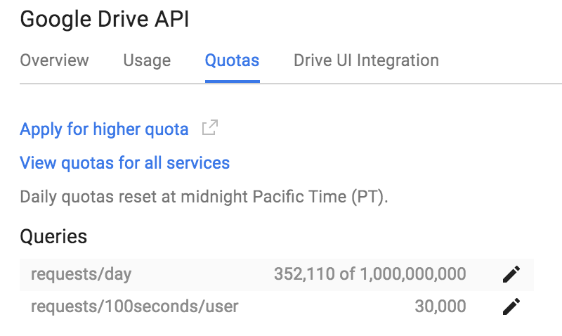

# How to use the Lustre/HSM Google Drive copytool

This page will guide you through the installation steps. A good knowledge of the Lustre filesystem is required.

## Requirements

### lhsmtool_cmd

**ct_gdrive** is the true _copytool_, copying data from Lustre to Google Drive and vice versa, but wouldn't work without **lhsmtool_cmd**, an open source and generic
Lustre/HSM agent that launches a command when an action (archive, restore) is
requested by the Lustre/HSM coordinator. **lhsmtool_cmd** comes with the Lustre/HSM magic but does not perform the copy itself, it just spawns sub-commands like **ct_gdrive** and provides a seekable file descriptor suitable to use directly with the official Google API Client library. This design is very efficient.

So, you will need:

* `lhsmtool_cmd` daemon ([lhsmtool_cmd.c](https://github.com/cea-hpc/robinhood/blob/master/src/tools/lhsmtool_cmd.c)) available in `robinhood-tools-3.x.lustre2.x.elx.rpm`

#### Building lhsmtool_cmd from source

To build the latest Robinhood v3 RPMs including robinhood-tools on RHEL:

```
$ git clone git@github.com:cea-hpc/robinhood.git
$ cd robinhood
$ git checkout b_3.0
$ sh ./autogen.sh
$ ./configure --with-lustre=/path/to/lustre-source-dir (with no / at the end)
$ make rpms
```

### Software

 * Lustre 2.5+
 * Python 2.7 (or Python 2.6 with `python-argparse`)
 * [Google API Client Library for Python](https://developers.google.com/api-client-library/python/start/installation#installing-the-client-library)
 * [Robinhood](https://github.com/cea-hpc/robinhood/wiki) with its SQL database
    * automatically triggers HSM archival requests
    * uses [Lustre changelogs](https://build.hpdd.intel.com/job/lustre-manual/lastSuccessfulBuild/artifact/lustre_manual.xhtml#lustremonitoring) instead of constantly scanning the filesystem!!

###  Hardware

 * At least one _HSM agent node_: dedicated Lustre client(s) with a good network connection to Google Drive
    * for both `lhsmtool_cmd` and `ct_gdrive.py`
 * A Robinhood server

### Google Drive

 * A Google Drive account (eg. unlimited [Drive for Education](https://www.google.com/edu/products/productivity-tools/) account)

## Google config

### Google API credentials installation

Create a Drive API project in the Drive API Developer Console with a **ct_gdrive** application,
download `client_secret.json` and then use **ct_gdrive_oauth2.py** to complete OAuth2 Flow and
store credentials for the first time.

```console
$ python ct_gdrive_oauth2.py --client-secret client_secret.json --creds-dir /path/to/creds/
Go to the following link in your browser:

    https://accounts.google.com/o/oauth2/auth?scope=https%3A%2F%2Fwww.googleapis.com%2Fauth%2Fdrive.file&redirect_uri=urn%3Aietf%3Awg%3Aoauth%3A2.0%3Aoob&response_type=code&client_id=.....

    Enter verification code: 
    Authentication successful.
    Storing credentials to creds/ct_gdrive_creds.json
```

By default, the [auth scope](https://developers.google.com/drive/v2/web/scopes#google_drive_scopes)
used by **ct_gdrive** is _drive.file_ (per-file access to files created or opened by the app).
Thus **ct_gdrive** cannot access your other Google Drive files.

You can now use the **ct_gdrive.py** copytool along with **lhsmtool_cmd** by specifying the same
credentials directory in `lhsm_cmd.conf` (example provided).

### Google Drive QPS

Google Drive has internal write limits that even the Google Developer Platform support isn't able to increase right now. However, it's worth asking them to increase your QPS "because you have a lot of files". Use the _Apply for higher quota_ link in the Google API manager:

<div align="center">
  <br><br>
</div>

## Enabling Lustre/HSM

Please see the [official Lustre documentation to learn how to enable  Lustre/HSM](https://build.hpdd.intel.com/job/lustre-manual/lastSuccessfulBuild/artifact/lustre_manual.xhtml#lustrehsm)
on your Lustre 2.5+ filesystem.

In a nutshell, start the Lustre/HSM coordinator thread and set max_requests to 1 (for testing purposes):

```console
$ ssh mds
$ lctl set_param mdt.$FSNAME-MDT0000.hsm_control=enabled
mdt.lustre-MDT0000.hsm_control=enabled
$ lctl set_param mdt.$FSNAME-MDT0000.hsm.max_requests=1
mdt.lustre-MDT0000.hsm.max_requests=1
```

On your HSM agent node, be sure to configure [/etc/lhsm_cmd.conf](lhsm_cmd.conf) to use **ct_gdrive**.
This configuration file should contain the Google fileID of your parent folder in Google Drive, where you want
all your HSM files to be stored. Also, if you have any issue, you can change `--logging_level=WARNING` to
`--logging_level=DEBUG`.

```ini
[commands]
archive = /path/to/ct_gdrive.py --action=push --fd={fd} --fid={fid} --logging_level=WARNING --lustre-root=/lustre --gdrive-root=0B4bz2HUB5rZtallfYU03ABCDEFg --creds-dir /path/to/creds/
restore = /path/to/ct_gdrive.py --action=pull --fd={fd} --fid={fid} --logging_level=WARNING --lustre-root=/lustre --gdrive-root=0B4bz2HUB5rZtallfYU03ABCDEFg --creds-dir /path/to/creds/
```

Then start your lhsmtool_cmd HSM agent:

```console
$ lhsmtool_cmd --abort-on-error --fanout 16 -vv /lustre/ |& tee -a /var/log/lhsmtool_cmd.log
```

Archive some files manually first:

```console
$ lfs hsm_state 2016-03-18-raspbian-jessie-lite.zip
2016-03-18-raspbian-jessie-lite.zip: (0x00000000)
$ md5sum 2016-03-18-raspbian-jessie-lite.zip 
eeec6c7757027b3ef3ff2ae75d7c6982  2016-03-18-raspbian-jessie-lite.zip
$ lfs hsm_archive 2016-03-18-raspbian-jessie-lite.zip
$ lfs hsm_state 2016-03-18-raspbian-jessie-lite.zip
$ 2016-03-18-raspbian-jessie-lite.zip: (0x00000009) exists archived, archive_id:1
```

`lfs hsm_archive` should trigger an ARCHIVE request to the copytool.

If successful, release an already archived file:
```console
$ lfs hsm_release 2016-03-18-raspbian-jessie-lite.zip
$ lfs hsm_state 2016-03-18-raspbian-jessie-lite.zip
2016-03-18-raspbian-jessie-lite.zip: (0x0000000d) released exists archived, archive_id:1
$ du 2016-03-18-raspbian-jessie-lite.zip
1   2016-03-18-raspbian-jessie-lite.zip
```

Note: releasing file data in Lustre won't trigger any copytool action.

Finally, restore a previously released file by accessing the file data:

```console
$ md5sum 2016-03-18-raspbian-jessie-lite.zip
eeec6c7757027b3ef3ff2ae75d7c6982  2016-03-18-raspbian-jessie-lite.zip
```

The next steps are to:
* use Robinhood to automatically triggers archive requests
* increase max_requests to start migrating files in parallel

## Robinhood configuration

Robinhood v3 is much more flexible than v2 especially with Lustre/HSM.
A full installation of Robinhood v3 is beyond the scope of this document, please refer to the
[official Robinhood v3 documentation](https://github.com/cea-hpc/robinhood/wiki/robinhood_v3_admin_doc).

We recommend to define your file classes according to the size of the files. This will help migrate the largest files quickly, as small files are more difficult to archive.

Example of robinhood options (initial scan, read changelogs, archive immediately). On RHEL you can put that in `/etc/sysconfig/robinhood`:

```
RBH_OPT="-F --scan --readlog --run=lhsm_archive --detach"
```

Also, an example of lhsm_archive rules is provided below:

```
#### Lustre/HSM archive configuration ####

lhsm_archive_parameters {
    nb_threads = 4;

    ## archive 100K files max at once
    max_action_count = 100000;
    #max_action_volume = 10TB;

    # suspend policy run if action error rate > 10% (after 100 errors)
    suspend_error_pct = 10%;
    suspend_error_min= 100;
}

lhsm_archive_rules {
    #
    # ignore empty or tiny files, or very large file (Google Drive limit is 5 TB per file)
    # 
    ignore_fileclass = emptyfiles;
    ignore_fileclass = smallfiles;
    ignore_fileclass = hugefiles;

    # big files should be 3 days old before being archived
    rule archive_big {
        target_fileclass = bigfiles;
        action_params { archive_id = 1; }
        condition { last_mod >= 3d }
    }

    # fallback rule
    rule default {
        action_params { archive_id = 1; }
        condition { last_mod >= 1d }
    }
}

# run every hour
lhsm_archive_trigger {
    trigger_on = periodic;
    check_interval = 1h;
}
```

You may want to run the lhsm_archive policy manually first:

```console
$ robinhood --run="lhsm_archive(class:stdfiles,max-count=10K)" --once
```
