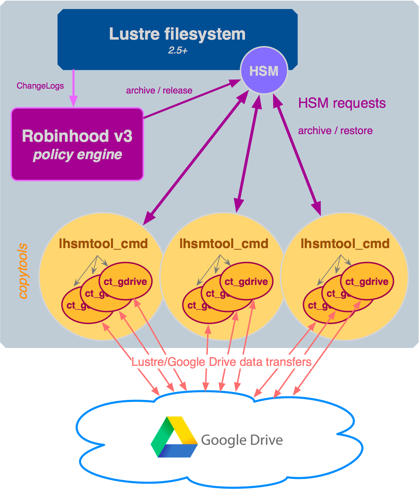

# Lustre/HSM Google Drive copytool

**ct_gdrive** is an open source copytool enabling secure and transparent
Google Drive cloud storage tier in Lustre using Robinhood.

* [Lustre](http://lustre.org/) is a parallel distributed file system, generally used for high performance computing (HPC).

* [Google Drive](https://www.google.com/drive/) is a Cloud-based object storage system.

* [Robinhood policy engine](https://github.com/cea-hpc/robinhood/wiki/robinhood_v3_admin_doc) is used to setup and apply policies for backup and tiering.

**ct_gdrive** transfers files from [Lustre](http://lustre.org/) to
[Google Drive](https://www.google.com/drive/), and vice versa.
Used either for Backup/Disaster Recovery or as an HSM tier to expand your Lustre
filesystem, **ct_gdrive** directly uses the
[Google API Client Library for Python](https://developers.google.com/api-client-library/python/start/installation#installing-the-client-library) to minimize the number of remote cloud storage API requests
needed to archive/restore files using Lustre/HSM.

Each Lustre file is stored in Google Drive using its Lustre FID as the name.
When archived for the first time, a file description with some info like the
original file path is added.
**ct_gdrive** supports the upload of multiple versions of a same file to
Google Drive. However, managing these versions is not supported from Lustre.

**ct_gdrive** should be used with **lhsmtool_cmd**, an open source and generic
Lustre/HSM agent that launches a command when an action (archive, restore) is
requested by the Lustre/HSM coordinator.

## Principle

    

## Requirements and installation

Please see the [HOWTO](HOWTO.md).

## License

**ct_gdrive** is published under the [GPLv3](http://www.gnu.org/licenses/gpl-3.0.en.html) license.

## Limitations

As of today, **ct_gdrive** works with a single Google Drive account, but a version
supporting multiple accounts is planned.

## Contact info

**ct_gdrive** is maintained and used in production by [Stanford Research Computing](https://srcc.stanford.edu/) where we
successfully pushed several millions of files and more than 1 PB to Google Drive in about a month.

Have questions? Feel free to contact us at srcc-support@stanford.edu

    

